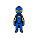

<p align="center">
  
  
  
  
  
</p>

<h1 align="center">BuddyQuest</h1>

<p align="center">
  <strong>An AI-powered educational RPG for kids</strong><br/>
  <em>Built with SwiftUI + SpriteKit for iOS and macOS</em>
</p>

<p align="center">
  
  
  
  
  
  
</p>

---

BuddyQuest is a top-down pixel-art RPG where kids explore themed worlds, befriend AI companions, and level up by solving educational challenges. It adapts to each child's skill level in real time, generates fresh questions using AI, and runs natively on iPhone, iPad, and Mac with **zero external dependencies**.

## Highlights

- **4 subject zones** &mdash; Language Arts, Math, Science, and Social Skills
- **5 challenge types** &mdash; Multiple Choice, True/False, Ordering, Matching, and Mixed Rounds
- **4 AI buddies** that follow you, cheer you on, give hints, and grow a friendship bond
- **Adaptive difficulty** that tracks per-subject accuracy and scales K&ndash;8
- **AI-powered questions** via Apple Intelligence, OpenAI, or Anthropic (Bring Your Own Token)
- **Offline fallback** with 200+ hand-curated questions &mdash; no internet required
- **Multi-profile support** &mdash; up to 3 kids can share one device
- **Parent dashboard** with progress reports, gated behind a parental pin
- **Cross-platform** &mdash; one codebase, native on iOS 17+ and macOS 14+

## Architecture

```
BuddyQuest/
├── BuddyQuestKit/          # Swift Package — all shared game logic (zero deps)
│   └── Sources/
│       ├── Engine/          # GameEngine (SKScene), Input, Camera, Collision, Audio
│       ├── Characters/      # Player, Buddy (4 types), NPC with patrol & quest markers
│       ├── World/           # Room, Zone, WorldManager + 5 zone definitions
│       ├── GameSystems/     # Challenges, Quests, Dialogue, Progression, Save/Load
│       ├── AI/              # BYOT services (OpenAI, Anthropic, Apple Intelligence)
│       ├── Data/            # Quest data, dialogue trees, offline question bank
│       ├── Models/          # PlayerProfile, ProfileManager
│       └── Utilities/       # Constants, extensions
├── BuddyQuestUI/           # SwiftUI views — menus, profile, parent dashboard
├── BuddyQuestApp/          # @main entry point + pixel art assets
│   └── Art/                 # 50+ hand-crafted pixel art sprites & tiles
└── project.yml              # XcodeGen project definition
```

The game is split into a **pure Swift Package** (`BuddyQuestKit`) that contains all engine, gameplay, and AI logic, and a thin **app shell** (`BuddyQuestApp` + `BuddyQuestUI`) that handles SwiftUI navigation and platform hosting. This means the core can be built and tested with `swift build` alone &mdash; no Xcode required.

## Game World

| Zone | Theme | Subject | Rooms | Quests |
|------|-------|---------|:-----:|:------:|
| Buddy Base | Central hub | Tutorial | 3 | 3 |
| Word Forest | Enchanted woods | Language Arts | 3 | 3 |
| Number Peaks | Mountain range | Math | 3 | 3 |
| Science Lab | High-tech facility | Science | 3 | 3 |
| Teamwork Arena | Colosseum | Social Skills | 3 | 3 |

**15 rooms** connected by portal doors, **15 quests** organized in progressive chains, and **8+ NPCs** with dialogue trees and quest markers.

## Challenge System

Players encounter challenges by interacting with NPCs or quest objectives. Each challenge is a timed round of questions:

| Type | Description | Timer |
|------|-------------|:-----:|
| **Multiple Choice** | Pick one of four answers | 30s |
| **True / False** | Evaluate a statement | 20s |
| **Ordering** | Arrange items in sequence | 45s |
| **Matching** | Pair items from two columns | 45s |
| **Mixed Round** | Combination of the above | varies |

Challenges support **touch input** on iOS (tap to select) and **keyboard** on macOS (arrow keys + E/Enter), with full **game controller** support on both platforms.

## AI Integration (BYOT)

BuddyQuest uses a **Bring Your Own Token** architecture. Parents can optionally configure an API key in the settings to unlock AI-generated questions, Socratic hints, and dynamic buddy dialogue.

```
Fallback chain:  Apple Intelligence  →  Cloud API  →  Offline Question Bank
```

| Provider | Model | Key Required? |
|----------|-------|:------------:|
| Apple Intelligence | On-device | No |
| OpenAI | GPT-4o-mini | Yes (BYOT) |
| Anthropic | Claude 3.5 Haiku | Yes (BYOT) |
| Offline | Static bank | No |

API keys are stored securely in the device Keychain. The game works perfectly offline with no API key configured.

**AI is used for:**
- Generating grade-appropriate questions on-the-fly
- Grading open-ended answers with meaningful feedback
- Providing Socratic hints (4 levels of scaffolding, never spoiling the answer)
- Generating contextual buddy dialogue based on game state

## Buddy Bond System

Each buddy specializes in a subject and grows a friendship bond with the player:

| Buddy | Subject | Personality |
|-------|---------|-------------|
| **Nova** | Science | Curious explorer |
| **Lexie** | Language Arts | Bookworm storyteller |
| **Digit** | Math | Number cruncher |
| **Harmony** | Social Skills | Team player |

The bond deepens through gameplay and unlocks abilities:

| Bond Level | Points | Unlock |
|------------|:------:|--------|
| New Friend | 0 | Following, speech bubbles |
| Good Buddy | 50 | Challenge hints |
| Great Buddy | 150 | +10% XP bonus |
| Best Buddy | 300 | Second-chance retry |

## Adaptive Difficulty

The progression system tracks accuracy per subject over a rolling window of 10 questions:

- **> 80% accuracy** &rarr; difficulty increases
- **< 40% accuracy** &rarr; difficulty decreases

Five difficulty tiers span Kindergarten through 8th Grade:

`Beginner` &rarr; `Easy` &rarr; `Medium` &rarr; `Hard` &rarr; `Advanced`

## Getting Started

### Prerequisites

- **Xcode 16+** (for building with `xcodebuild`)
- **Swift 5.9+** (for `swift build` on the package)
- [XcodeGen](https://github.com/yonaskolb/XcodeGen) (for regenerating the Xcode project)

### Build & Run

```bash
# Clone the repository
git clone https://github.com/hans30075/BuddyQuest.git
cd BuddyQuest

# Option A: Open in Xcode (recommended)
open BuddyQuest.xcodeproj
# Select scheme: BuddyQuest-macOS or BuddyQuest-iOS → Run

# Option B: Build the Swift Package directly
cd BuddyQuestKit
swift build

# Option C: Build from the command line
xcodebuild -project BuddyQuest.xcodeproj \
  -scheme BuddyQuest-macOS \
  -configuration Debug build

# Regenerate Xcode project after structural changes
brew install xcodegen   # if not installed
xcodegen generate
```

### Running on iOS Simulator

```bash
xcodebuild -project BuddyQuest.xcodeproj \
  -scheme BuddyQuest-iOS \
  -destination 'platform=iOS Simulator,name=iPad Pro 11-inch' \
  -configuration Debug build

# Install and launch
xcrun simctl install booted Build/Products/Debug-iphonesimulator/BuddyQuest.app
xcrun simctl launch booted com.buddyquest.app
```

## Controls

### macOS (Keyboard)

| Key | Action |
|-----|--------|
| `W` `A` `S` `D` / Arrow Keys | Move |
| `E` / `Enter` | Interact / Confirm |
| `Esc` | Cancel / Back |
| `I` | Inventory |
| `Q` | Quest Log |
| `P` | Pause |

### iOS (Touch)

| Gesture | Action |
|---------|--------|
| Virtual Joystick (bottom-left) | Move |
| `E` Button (bottom-right) | Interact |
| `I` Button (bottom-right) | Inventory |
| Tap answer option | Select answer in challenges |
| Tap profile badge (top-right) | Open pause / profile menu |

Game controllers (MFi, Xbox, PlayStation) are supported on both platforms.

## Project Stats

| Metric | Value |
|--------|-------|
| Lines of Swift | ~22,000 |
| Source files | 63 |
| Pixel art assets | 50+ sprites & tiles |
| External dependencies | **0** |
| Zones | 5 |
| Rooms | 15 |
| Quests | 15 |
| NPCs | 8+ |
| Challenge types | 5 |
| Buddy characters | 4 |
| Grade levels | K&ndash;8 |
| Subjects | 4 |
| Offline questions | 200+ |

## Tech Stack

| Layer | Technology |
|-------|-----------|
| Game Engine | SpriteKit (SKScene, SKSpriteNode, SKAction) |
| UI Framework | SwiftUI (sheets, navigation, overlays) |
| Package Manager | Swift Package Manager |
| Project Generator | XcodeGen |
| Input | Keyboard, Touch, GameController framework |
| Persistence | JSON files (Codable) + Keychain (API keys) |
| AI Integration | URLSession (REST APIs) + Apple Intelligence |
| Collision | Custom AABB with tilemap-aware resolution |
| Camera | Smooth follow with edge clamping |
| Audio | AVFoundation |

## Contributing

Contributions are welcome! Here are some areas where help is appreciated:

- **New question content** &mdash; Expand the offline question bank
- **New zones** &mdash; Add themed worlds (History, Music, Geography)
- **Accessibility** &mdash; VoiceOver support, colorblind-friendly palettes
- **Localization** &mdash; Translate questions and UI to other languages
- **Art** &mdash; Additional pixel art sprites and tile variations
- **Tests** &mdash; Unit tests for game systems and AI services

### Development Workflow

1. Fork the repository
2. Create a feature branch (`git checkout -b feature/amazing-feature`)
3. Make your changes
4. Build and verify (`swift build` in `BuddyQuestKit/`)
5. Commit your changes (`git commit -m 'Add amazing feature'`)
6. Push to the branch (`git push origin feature/amazing-feature`)
7. Open a Pull Request

## Roadmap

- [ ] tvOS support (Apple TV with game controller)
- [ ] Multiplayer co-op challenges
- [ ] Achievement system with badges
- [ ] Custom avatar creator (draw your own character)
- [ ] Teacher dashboard with classroom management
- [ ] More question types (fill-in-the-blank, drag-and-drop diagrams)
- [ ] Procedurally generated dungeon rooms
- [ ] Leaderboards (opt-in, privacy-first)

## License

This project is currently unlicensed. Contact the author for usage terms.

---

<p align="center">
  <strong>Built with Swift, SpriteKit, and a love for learning.</strong><br/>
  <sub>Made by <a href="https://github.com/hans30075">hans30075</a></sub>
</p>
